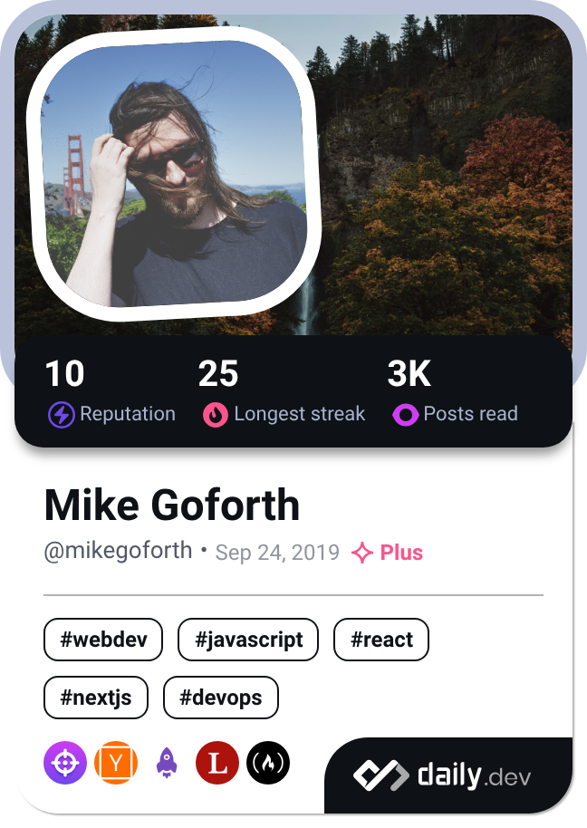

### Hi there 👋 I am Mike 🍻

I enjoy continual study while participating in and elevating individual/peer projects. If this sounds your kind of company shoot me a follow!

**Status:** Wedding week! 🍾🤵‍♂️💃 Only commit happening this week will be local.

What Else Is Going On?

- 🖥️ Working on a super secret Discord bot. Helping other servers consolidate bloat by creating clean and curated solutions.
- 📖 Reading documentation on Astro. So far enjoying it as a simple portfolio/blog solution.
- 📚 Studying animation so I can begin crafting Michelin star dishes in WebGL (as long as it is a donut).
- 🧳 Prepping to be dropped into an interview at any given moment. Life has been strange. Better to stay ready than to get ready.
- 📫 How to reach me: Any options mentioned here will do! For a faster response I recommend LinkedIn.
<!-- - 👯 I’m looking to collaborate on ...
- 🤔 I’m looking for help with ...
- 💬 Ask me about ...-->
<!-- - ⚡ Fun fact: --> 

